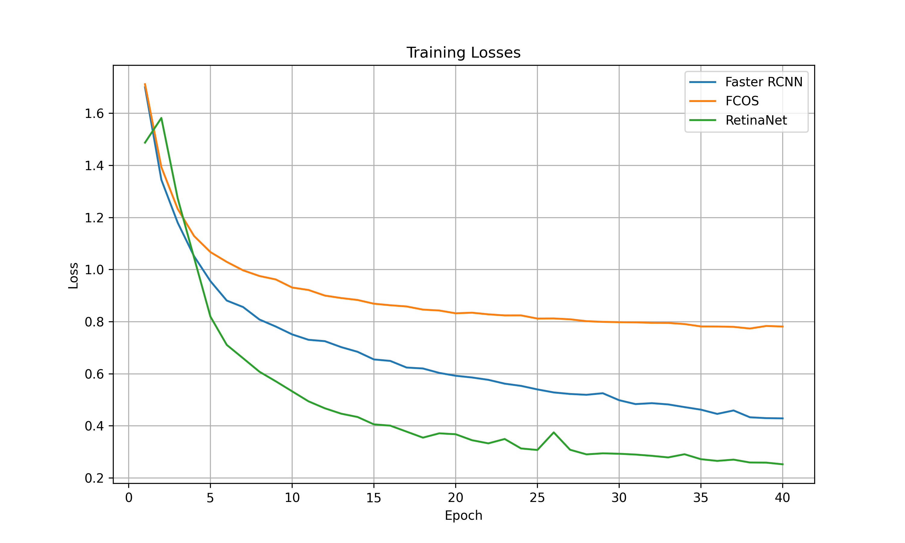
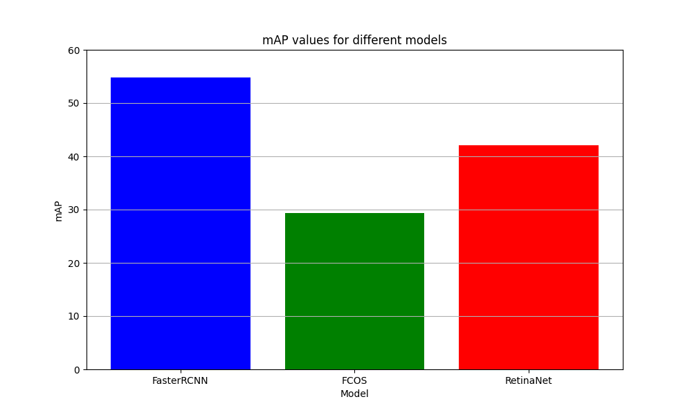

[](https://classroom.github.com/a/afsDeTyi)
# 1. Kaggle Notebook
For the project I had done all the code development in the repository of assignment4. Later I had copied all the changes 
from that repository into this one. 

I have run many versions on the following notebook and in the end I have trained 
three models on the same number of epochs.

https://www.kaggle.com/code/husainsaif365/final-project/edit


# 2. Customizations

In my config file, I have then following customizations:

```python
MODEL
NUM_CLASSES
BATCH_SIZE
EPOCHS
BASE_LR
WEIGHT_DECAY
NO_CUDA
RUN_NAME
DO_EARLY_STOPPING
BACKBONE
```
For all the models, I have used ADAMW as the optimizer and on oneCycleLR as the scheduler.

# 3. Faster RCNN training
Once I had my code set up for faster RCNN, I had run a dummy fasterRCNN model with a resnet 18 backbone with one epoch to check how well it runs. 
This is adderessed in version 31. With the following parameters on the first epoch:

```python
MODEL = 'faster_rcnn'
NUM_CLASSES = 6
BATCH_SIZE = 20
EPOCHS = 1
BASE_LR = 0.004
WEIGHT_DECAY = 0.0005
NO_CUDA = False
RUN_NAME = 'run2'
DO_EARLY_STOPPING = False
BACKBONE = 'resnet18'
```
with this, I got the following results on EvalAI (Submission name on evalAI: (Faster R-CNN -> First Epoch):

```json
[
  {
    "track_a": {
      "mAP": 11.437116554215802,
      "mAP IoU=.50": 25.752326350601034,
      "mAP IoU=.75": 8.465897546783857
    }
  }
]
```
Since this result seemed promising, I run the same model with the same configuration parameters for 80 epochs 
(Version Name: faster rcnn train)

and with that, I get my best results among all the models as follows (Submission name on evalAI: (FasterRCNN/Resnet18 -> Full Run)):

```json 
[
  {
    "track_a": {
      "mAP": 55.1754410866164,
      "mAP IoU=.50": 68.31987098179579,
      "mAP IoU=.75": 62.21139984946959
    }
  }
]
```
At this point I was running out of enough GPU resources to run all three models and give their results. After running FCOS and RetinaNet,
I had done another run(version name: Faster RCNN/Resnet18) with the following parameters:

```python
MODEL = 'faster_rcnn'
NUM_CLASSES = 6
BATCH_SIZE = 4
EPOCHS = 40
BASE_LR = 0.004
WEIGHT_DECAY = 0.0005
NO_CUDA = False
RUN_NAME = 'run2'
DO_EARLY_STOPPING = False
BACKBONE = 'resnet18'
```
With this model, I get the following results (Submission name on evalAI:fasterRCNN/resnet18):
```json 
[
  {
    "track_a": {
      "mAP": 54.81280263925944,
      "mAP IoU=.50": 68.55476866370722,
      "mAP IoU=.75": 61.93909560139173
    }
  }
]
```
Another reason I had run this model was so that the plot of train losses would be easy to visualize 
since all the models are run on 40 epochs. Therefore, this is the model I have used to make all visualizations related to 
FasterRCNN.
# 4. FCOS training
I run my FCOS model with the following parameters (version name: FCOS Full Run):
```python
MODEL = 'fcos'
NUM_CLASSES = 6
BATCH_SIZE = 4
EPOCHS = 40
BASE_LR = 0.0008
WEIGHT_DECAY = 0.00011
NO_CUDA = False
RUN_NAME = 'run2'
DO_EARLY_STOPPING = False
BACKBONE = 'resnet18'
```
With this model, I get the following results on evalAI (Submission name on evalAI: 	FCOS/Resnet18):
```json
[
  {
    "track_a": {
      "mAP": 29.388947867224775,
      "mAP IoU=.50": 41.23979699805759,
      "mAP IoU=.75": 34.214560978109745
    }
  }
]
```


# 5. RetinaNet training

I run my RetinaNet model with the following configuration parameters(Version name: RetinaNet Full Run):
```python
MODEL = 'retina_net'
NUM_CLASSES = 6
BATCH_SIZE = 2
EPOCHS = 40
BASE_LR = 0.0008
WEIGHT_DECAY = 0.00011
NO_CUDA = False
RUN_NAME = 'run2'
DO_EARLY_STOPPING = False
BACKBONE = 'resnet18'
```
My retina net would not run initially. It woould cause my cuda memory to run out on kaggle. A way around this was to create 
a function that would extract the trainable layers from the pretrained backbone and also freeze the weights from the 
pretrained layer so that the statistics of the pretrained weights are used and no new stats are created. 
</br>
</br>
With this, change my model seemed to work fine with my given parameters, and I get the following results (Submission name on evalAI: RetinaNet/Resnet18):
```json
[
  {
    "track_a": {
      "mAP": 42.12001653932782,
      "mAP IoU=.50": 66.40345319345558,
      "mAP IoU=.75": 44.41609729938921
    }
  }
]
```
# 6. Visualizations
For the visualizations, I have plot 10 images from the test dataset and in the following, Each row corresponds to a certain image with the bounding boxes 
and their scores and each column corresponds to the model that was used:


# 7. Inferences
The following is a plot of the train losses of each model for 40 epochs: 


<br>
This plots the mAP values achieved by each model after 40 epochs:



<br>

From the results it can be concluded that the RetinaNet model tends to overfit on the training set and the FCOS model tends 
to underfit. 

### Sources: 
<br>
https://openai.com/chatgpt/ <br>
https://www.kaggle.com/ <br>
https://pytorch.org/vision/main/models/faster_rcnn.html <br>
https://pytorch.org/vision/main/models/fcos.html <br>
https://pytorch.org/vision/main/models/retinanet.html <br>